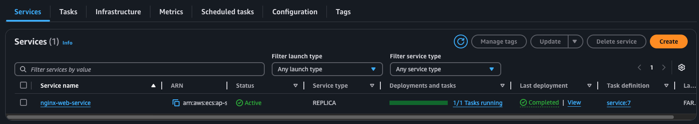
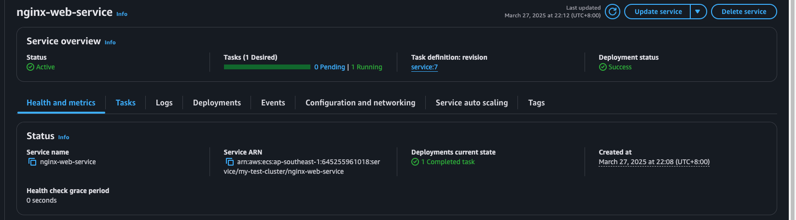
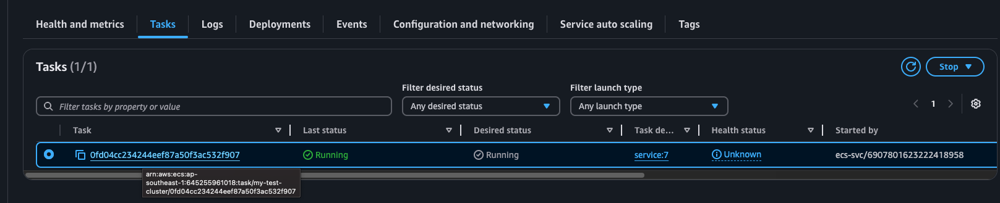
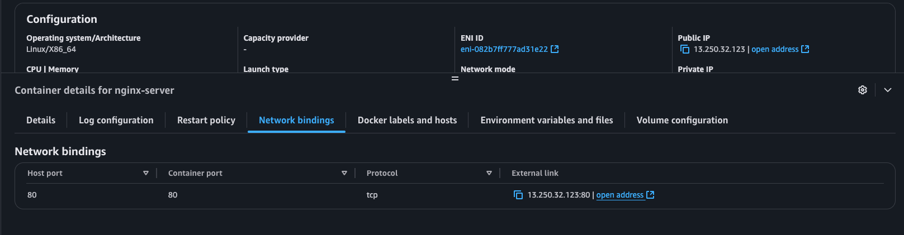
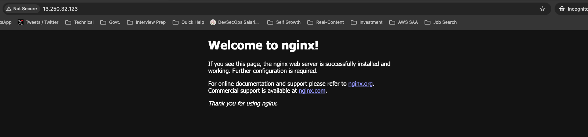

# ECS Cluster Creation POC
In this POC I create a simple `ECS cluster` to deploy a basic `Nginx` web server.

## Specification
This does not include `Load Balancer` hence running the ECS service task as `Network Mode: awsvpc`, this is required when we dont attach and `LB` with the cluster.

## How to run?
- Get inside `dev` directory.
- Execute below commands
    ```bash
    terraform init
    terraform apply
    ```

## How to acceess?
Since in this POC I don't attach a `Load Balancer` I use IP address to access the service.
### Step 1
Open the service

### Step 2
Click on `Tasks` tab

### Step 3
Click on running task

### Step 4
Click the `Network Binding` section

### Step 5
Click the `open address` link this will open it in browser
